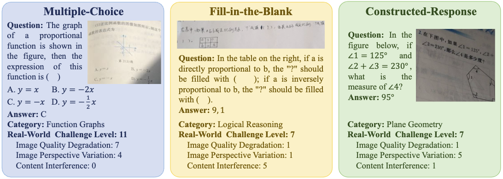
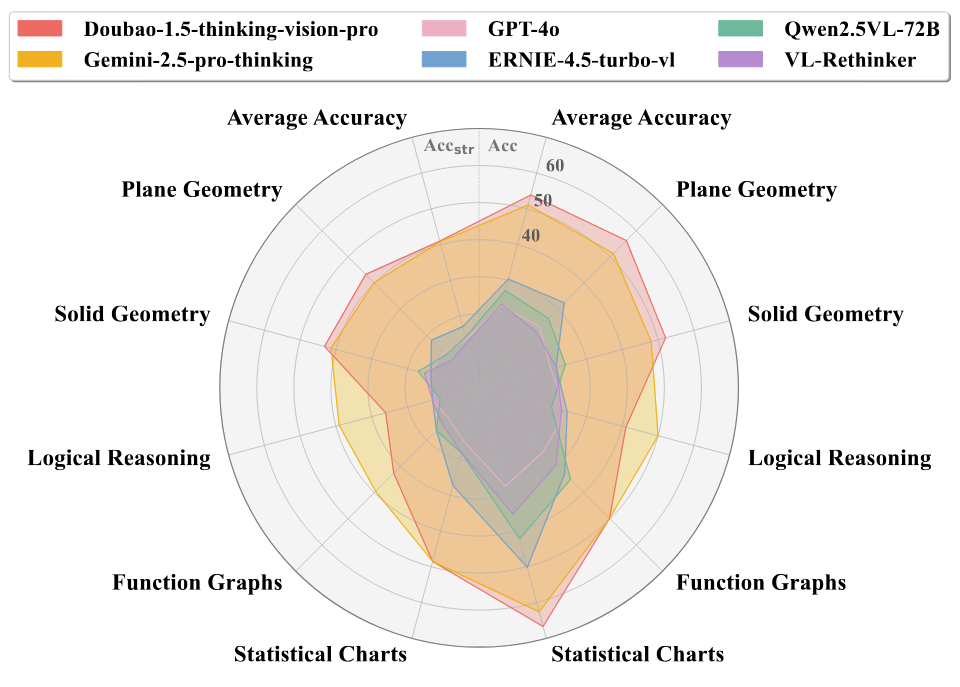
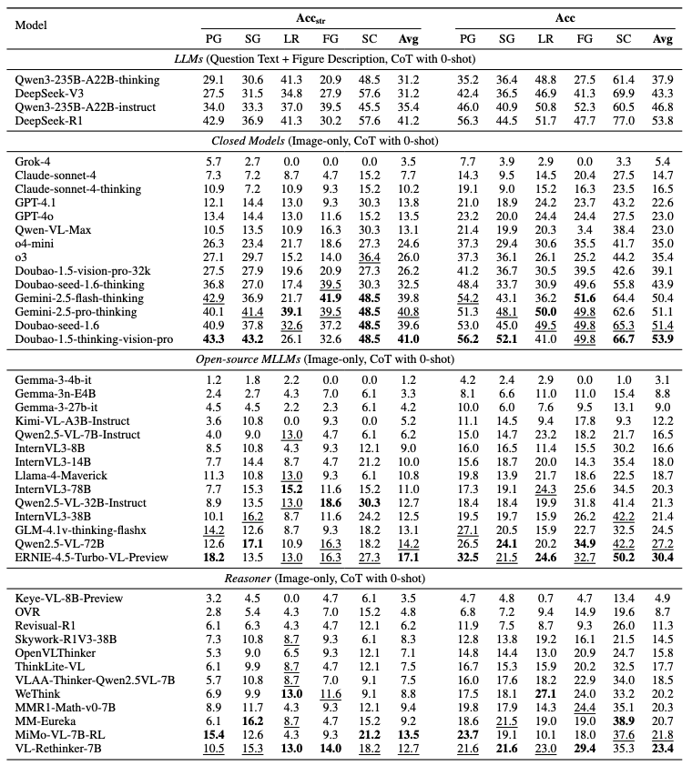
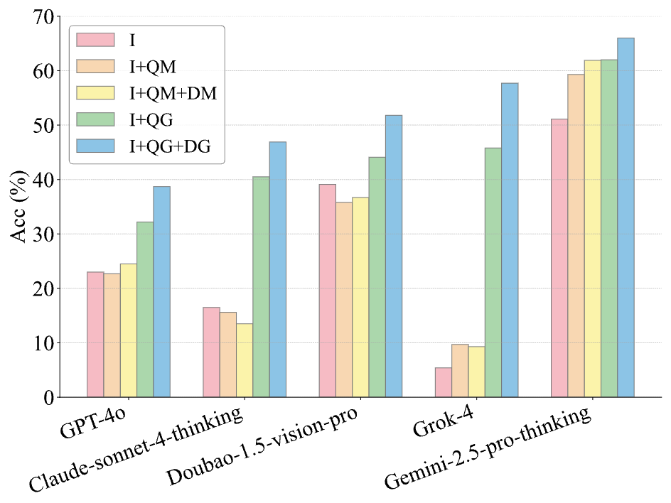
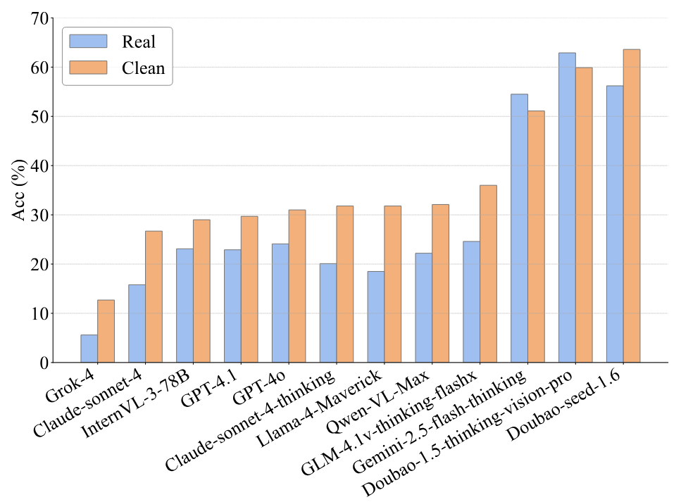

<div align="center">

  <h1 style="margin: 0; font-size: 1.8em;">
    MathReal: We Keep It Real! A Real Scene Benchmark for Evaluating Math Reasoning in Multimodal Large Language Models
  </h1>
    
  [](https://arxiv.org/abs/2508.06009)<!--修改-->
  [](https://github.com/junfeng0288/MathReal)
  [](https://huggingface.co/datasets/junfeng0288/MathReal)
  <!-- [](https://twitter.com/YourTwitterHandle) -->
  [](https://opensource.org/licenses/MIT)
   

</div>

## 📚 Overview

- [📚 Overview](#-overview)
- [⚡ News](#-news)
- [📖 Introduction](#-introduction)
- [🍭 Results](#-results)
- [🎯 Datasets](#-datasets)
- [✨ Getting Started](#-getting-started)
- [🎁 Evaluation](#-evaluation)
- [🚧 TODO](#-todo)
- [📮 Contact](#-contact)
- [📄 Citation](#citation)

## ⚡ News

- [2025/08/11] 🔥 MathReal dataset is now open-source on [Hugging Face](https://huggingface.co/datasets/junfeng0288/MathReal).
- [2025/08/08] 🔥 MathReal paper available on [arXiv](https://arxiv.org/abs/2508.06009).

## 📖 Introduction

**MathReal** is a 2,000-question dataset of visual math problems from authentic K–12 educational contexts, with images captured by handheld mobile devices that contain both question text and relevant figures. Unlike prior clean-input benchmarks, it reflects real-world complexity, classifying images into 3 main degradation types—image quality loss, perspective variation, and irrelevant content interference—further divided into 14 subcategories. Questions span 5 core knowledge/ability categories, 3 question types, and 3 difficulty levels. Six experimental settings evaluate 40 MLLMs, revealing substantial performance drops in realistic conditions. Detailed error analysis highlights challenges in recognition, comprehension, and reasoning, offering guidance for future model improvement.


### 🔑 Key Features

1. **Diverse Question Set:** Contains 2,000 K–12 mathematical questions spanning 5 core knowledge/ability categories, 3 question types, and 3 difficulty levels, covering a broad spectrum of curriculum-relevant topics.

2. **Real-World Images:** All questions are presented as handheld-device photographs taken in authentic educational settings, incorporating 3 main visual degradation types—image quality degradation, perspective variation, and irrelevant content interference—further divided into 14 subcategories.

3. **Evaluation Metrics:** Includes 6 experimental settings designed to systematically test and compare MLLMs’ visual-mathematical reasoning abilities, enabling fine-grained error analysis in recognition, comprehension, and reasoning.


## 🍭 Results









**MathReal** demonstrates a significant challenge to MLLMs in real-world scenarios.

## 🎯 Datasets

| **Dataset**                          | **Hugging Face** |  **Size** |
|-----------------------------------|------------------|------------------|
| MathReal(testmini) | https://huggingface.co/datasets/junfeng0288/mathreal |  480 |

## ✨ Getting Started

### 🔧 Installing

You can install MathReal dependencies by running the following commands:
```bash
conda create -n mathreal python=3.12 -y && conda activate mathreal

cd MathReal
pip install -r requirements.txt
```

## 🎁 Evaluation

### Step 1: Extract Answers
```bash
python evaluate/extract_answer_1.py \
    --input <model_output.json> \
    --output <extracted_answers.json> \
    --timeout 10
```
**Purpose**: Extracts final answers from raw model outputs using OpenAI API

**Input**: JSON file containing model responses with `raw_output` field

**Output**: JSON file with extracted answers in `extracted_answer` field

### Step 2: Evaluate Answers
```bash
python evaluate/evaluation_answer_2.py \
    --gt_file <ground_truth.json> \
    --extract_file <extracted_answers.json> \
    --output_file <evaluation_results.json> 
```
**Purpose**: Compares extracted answers with ground truth using sophisticated evaluation criteria

**Features**:
- Mathematical equivalence checking (fractions vs decimals, algebraic expressions)
- Multi-part answer handling with partial credit
- Unit-aware comparison
- Multiple-choice question support

### Step 3: Calculate Final Scores
```bash
python evaluate/calculate_answer_3.py <evaluation_results.json >
```
**Purpose**: Computes category-wise and overall accuracy scores

**Output**: 
- Per-category accuracy (PG, SG, LR, FG, SC)
- Overall accuracy metrics
- Both strict and partial credit scoring


## 🚧 TODO

We are preparing to complete these tasks over the next few weeks, please stay tuned!

- 🚧 Release the whole test datasets.

## 📮 Contact

For questions, feedback, or collaboration opportunities, feel free to reach out: junfeng0288@gmail.com

## 📄 Citation

If you find our work useful for your research, please consider citing:

```bash
@misc{feng2025mathrealrealrealscene,
      title={MathReal: We Keep It Real! A Real Scene Benchmark for Evaluating Math Reasoning in Multimodal Large Language Models}, 
      author={Jun Feng and Zixin Wang and Zhentao Zhang and Yue Guo and Zhihan Zhou and Xiuyi Chen and Zhenyang Li and Dawei Yin},
      year={2025},
      eprint={2508.06009},
      archivePrefix={arXiv},
      primaryClass={cs.CV},
      url={https://arxiv.org/abs/2508.06009}, 
}
```